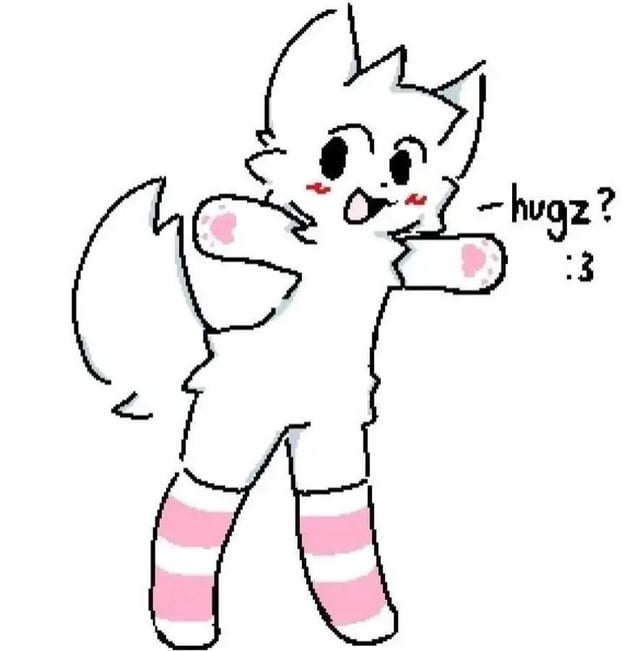
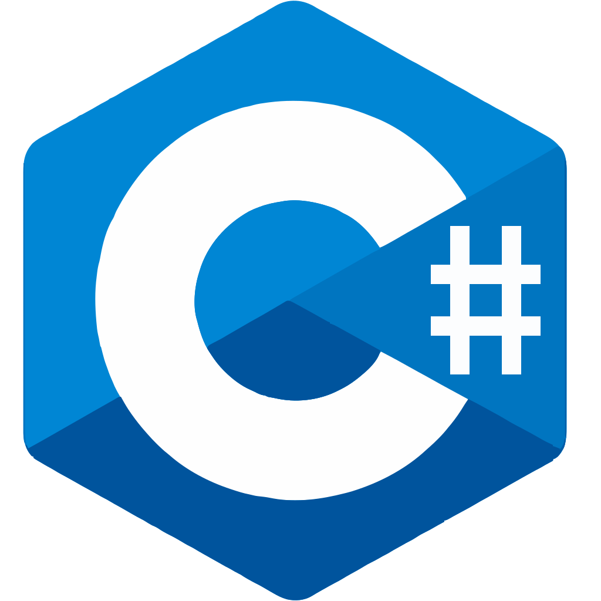
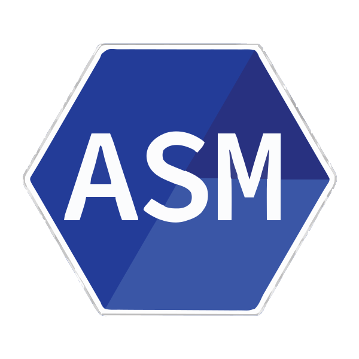
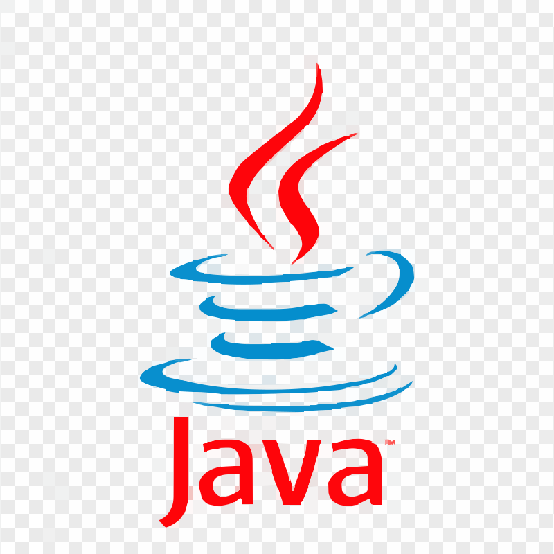
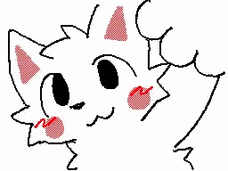

  
  
  
  

  

### Welcome to my GitHub page!
I am a small, indie even, bilingual dev with a dream - breaking into F1 as a data analyst.
I might, just might open streams/youtube page for my progress, stay tuned.

### Who am I?
---
I am Ersin — real name — a computer engineering student in Turkey.
I have a mission to be the worlds first data analyst as a Turkish person for F1.
Yes, my GPA is enough, yes I know this is a hard dream - stop thinking about it.

### How can I support you?
---
You can support me through Buy Me a Coffee and Patreon.

### Important Links
---
You might inevitably search for these, let me give you the important ones:\
www.linkedin.com/in/ersintezguler \
https://x.com/ersinsendromu

### My Techstack

---

  
  
  
  
  
  
  
  

### Meaning To Learn

---

  
  
  
  
  
  

> You are suddenly filled with years of muscle memory for a code you've never wrote...

  
<h3>My GitHub Stats</h3>

  

    
  

  

    
  

### Thank you for visiting my GitHub page!

---

  
  

