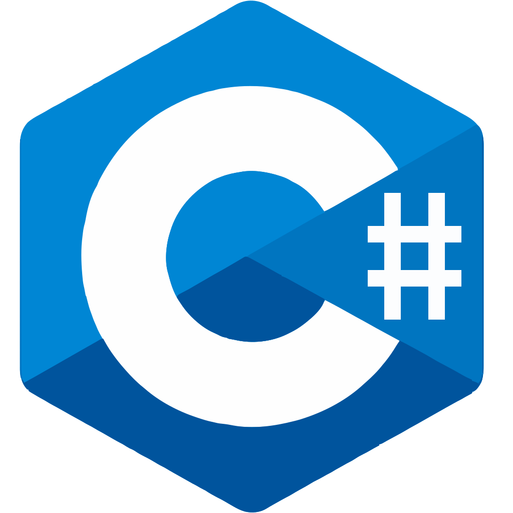

  
  
  
  

## Welcome to my GitHub page!

### Who am I?
---
I am Ersin, a computer engineering student in Turkey.
I am a low-level systems engineer, working barebones in C.
  
### My Techstack

---

  
  
  
  
  
  

> Despite everything, it is still **you**.

### ⚙️ Currently Engineering: Zero-Trust Custom Silicon 
> *Targeting TEKNOFEST Microchip Category & TÜBİTAK BİGG*

I am currently designing and building a custom RISC microprocessor from the physical logic gates up. No standard ARM/x86 bloat. No inherited hardware vulnerabilities.

**The Architecture:**
- **Physical Harvard Architecture:** Air-gapped data and instruction buses at the gate level.
- **Custom Instruction Set (ISA):** Implementing misaligned instruction widths to make standard buffer-overflow malware physically impossible to execute.
- **The Stack:** `Verilog` | `FPGA` | `Custom Assembly` | `Bare-Metal OS in C`

`[░░░░░░░░░░░░] 0% - In talks but will commence.`

  
<h3>My GitHub Stats</h3>

  

    
  

  

    
  

### Thank you for visiting my GitHub page!

#### Buy me a coffee. Or not. It is your money still.

---

